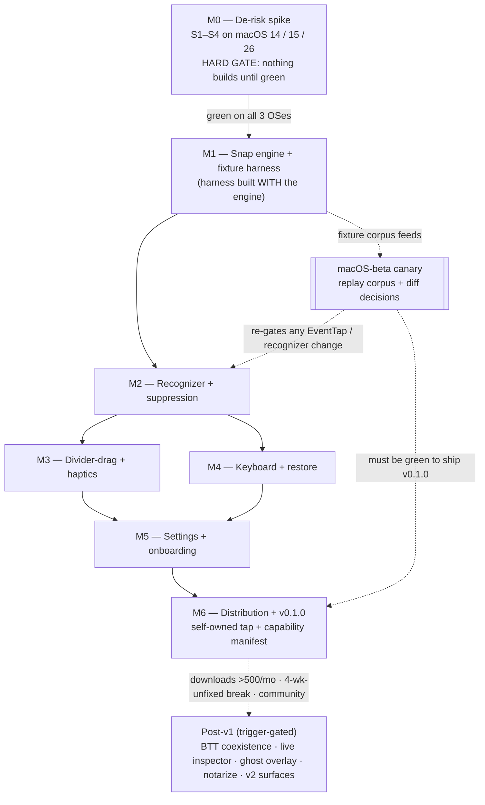

# Swoosh — Product Requirements

## Summary

Swoosh is a free, open-source, MIT-licensed macOS 14+ app that snaps and resizes windows via two-finger trackpad gestures on window titlebars — matching [Swish](https://highlyopinionated.co/swish/)'s *feel*, beating its 3×3 size ceiling with a fraction-native engine, and making its private-API footprint auditable. This document distills the settled decisions in `STRATEGY.md`, the technical canon in `SPEC.md`, the risk gate in `DERISK.md`, and the sequencing in `ROADMAP.md` into traceable, R-IDed requirements spanning the **M0 de-risk gate through v2**, as the direct source for the planning phase (`ce-plan`). It restates canon in requirements form; it does not re-decide the four resolved strategic forks.

---

## Problem Frame

Map the macOS window-manager market on two axes — *input model* × *license* — and exactly one cell is empty: **free + open-source + trackpad-gesture-primary**. Rectangle (~29k★), AeroSpace (~21k★), and Loop (~10.8k★) own the free keyboard/tiling quadrant; Swish ($16), BetterTouchTool, and Multitouch own the paid gesture quadrant. The free-gesture cell has had exactly one occupant — **Penc** — abandoned since July 2021. This is the Rectangle-vs-Magnet opening, ~7 years later, in the gesture niche (`STRATEGY.md §1`).

The cell stayed empty because the product leans on a **three-layer private/undocumented-API integration**: `CGEventTap` scroll suppression composed with the undocumented `MultitouchSupport.framework` finger-count SPI and `AXUIElement` titlebar hit-testing. Two confirmed, load-bearing macOS hazards make it genuinely fragile: the `.mayBegin` scroll phase silently vanished in Monterey (FB9724671, which broke Swish directly), and a synchronous AX hit-test can block scroll for up to ~500ms (FB11586064). That fragility — not lack of demand alone — is what made Penc go dormant, and it is why the de-risk spike and the record-and-replay fixture harness are first-class in this plan, not afterthoughts (`DERISK.md`).

Demand is treated as **real but unsized**: the empty cell admits a supply-side reading (the integration is hard) *and* a demand-side reading (Penc at ~1.2k★ vs Rectangle at ~29k★ may mean the free gesture audience is simply smaller). The bet is sized toward Penc-to-mid scale unless the "free Swish" thread volume, Swish's user base, the BTT/Multitouch cohort, and ultrawide complaints prove otherwise (`STRATEGY.md §1`).

Two clocks run inside the planning horizon (today = 2026-05-30):

- **The existential threat is Apple, not Swish.** macOS 15+ ships free, built-in drag-to-edge tiling. Once the OS matches "free," only three differentiators survive — *gesture feel* (titlebar swipe + divider-drag + haptics, which native tiling doesn't do), *experienceable auditability*, and *configurability beyond 3×3* — and the plan is built on them (`STRATEGY.md §2`).
- **Sept 1 2026** — Homebrew/cask removes all unnotarized casks (`--no-quarantine` already gone since Homebrew 5.0, Nov 2025). This governs only the *central* cask channel, forcing the distribution decision (notarize vs self-owned tap) to be made deliberately rather than deferred indefinitely (`STRATEGY.md §4.4`, `ROADMAP.md`).

---

## Key Decisions

These are the framing choices of record that constrain every requirement below. The first four are the strategic forks resolved during the 2026-05-30 re-plan — **settled**; planning should not relitigate them without new information (`STRATEGY.md §4`).

- **Charter — Product (grow it).** Swoosh deliberately occupies the empty cell; adoption is a goal. This unlocks the Rectangle playbook (HN/Reddit launch, Homebrew distribution, BTT-migration positioning) and obligates a sustainability answer plus a real maintenance commitment against every macOS beta. (`STRATEGY.md §4.1`)
- **Identity — Faithful clone, not a platform.** A tight, opinionated snap tool that matches Swish's feel and beats its 3×3 cap — *not* a programmable "Hammerspoon for the trackpad." No scripting surface, control socket, or user-bindable arbitrary actions in v1. (`STRATEGY.md §4.2`)
- **Durability — `MultitouchSupport` load-bearing; NSEvent is Plan B.** The private finger-count SPI is primary because the public `NSEvent` touch API is too constrained for system-wide titlebar gestures over arbitrary apps. The fragility is *managed*, not avoided, by the fixture harness. (`STRATEGY.md §4.3`, `SPEC.md §7`)
- **Distribution — Self-owned Homebrew tap now ($0); notarize later.** Ship today via our own tap with an `xattr` postflight (the AeroSpace model). Notarization (Apple Developer Program, $99/yr) is a deferred, reversible, traction-triggered upgrade, not a launch blocker. (`STRATEGY.md §4.4`)
- **Snap engine is fraction-native.** The core unit is a `FractionalRect`; `SnapTarget` is a tagged union whose load-bearing case is `.fraction(FractionalRect)`. It is **never** replaced by a closed set of named-position cases (`leftHalf`, `topRightQuarter`, …). Keeping fractions native is the architectural decision that mechanically kills the 3×3 ceiling and ships ultrawide N-column day one. (`SPEC.md §5`)
- **De-risk first.** The M0 spike gates everything; the fixture harness is built *with* the engine (M1), not bolted on; any change to `EventTap` or the gesture recognizer must re-pass the spike matrix before merge. (`DERISK.md §1`, §6; `ROADMAP.md` sequencing principles 1–2)
- **No telemetry, ever; MIT; auditability made experienceable.** No analytics, no network in the hot path. The CI-asserted capability manifest ships at v1 as the differentiator that Swish and Apple's tiling structurally cannot copy. (`STRATEGY.md §5–6`)

---

## Actors

- A1. **End user** — performs two-finger titlebar gestures and keyboard shortcuts to snap/resize windows. Spans the Swish-curious / ultrawide-monitor (primary), security-conscious (secondary), and BTT/Multitouch-switcher (tertiary) personas (`STRATEGY.md §3`).
- A2. **Contributor** — records fixtures via the release-build capture mode with no toolchain (the lowest-bar contribution), and may submit presets / per-app compatibility info (`DERISK.md §2`, `CONTRIBUTING.md`).
- A3. **Maintainer** — runs the macOS-beta canary, triages decision-log regressions, and owns the time-to-fix and continuity triggers that are the real anti-Penc safeguard (`STRATEGY.md §6.1`).
- A4. **macOS (system actor)** — simultaneously the event source (`CGEventTap`), the AX target, and the finger-count source (`MultitouchSupport`), **and** the existential competitor (native drag-to-edge tiling). This dual role is why onboarding must detect and offer to disable native tiling.
- A5. **Competing trackpad clients (BetterTouchTool / Multitouch)** — contend for `MultitouchSupport` + `CGEventTap`, which can freeze the trackpad; the target of the designed-in cooperative mode.

---

## Key Flows

- F1. Titlebar two-finger swipe → snap
  - **Trigger:** A4 delivers a two-finger scroll while A1's cursor is over a window titlebar.
  - **Steps:** Layer 1 tap observes the scroll; Layer 2 reads the finger-count atomic (exactly 2); Layer 3 checks the three synchronous suppression conditions from fast geometry and decides suppress/pass *in-thread*; on suppress, the precise AX locate + `FractionalRect` resolution + frame write runs off-thread on `swoosh.ax`.
  - **Outcome:** Window snaps to the resolved fraction; normal scrolling everywhere else (and normal scroll on the same titlebar) is untouched.
  - **Covers:** R10, R21, R23, R24

- F2. Two-finger hold + position grid picker
  - **Trigger:** A1 holds two fingers on a titlebar.
  - **Steps:** The cell under the cursor highlights on an overlaid grid (3×3 default, configurable); A1 moves to retarget; release commits, swipe outward cancels.
  - **Outcome:** Window snaps to the highlighted cell, or nothing happens on cancel.
  - **Covers:** R12, R22, R28

- F3. Divider-drag multi-window resize *(headline)*
  - **Trigger:** A1 left-mouse-drags the gap between two windows that share a snapped edge.
  - **Steps:** The event tap observes left-mouse-down; a synchronous non-blocking fast-geometry check decides whether the cursor sits in the shared-edge band; if so the event is consumed and a resize session begins, writing both frames in lockstep on `swoosh.ax`; otherwise the event passes through untouched.
  - **Outcome:** Both windows resize simultaneously along the shared edge; the relationship survives windows being moved by other tools.
  - **Covers:** R26, R27

- F4. Exit-fullscreen + restore
  - **Trigger:** A1 invokes the exit-fullscreen verb (gesture or `⌃⌥F`), or restores a snapped window (swipe ↓ / `⌃⌥⏎`).
  - **Steps:** Exit-fullscreen sets the private `"AXFullScreen"` attribute to `false` (fallback: `AXPress` the fullscreen button child); restore pops the per-window ring buffer.
  - **Outcome:** Window leaves native fullscreen reliably, or walks back to a previous frame.
  - **Covers:** R31, R32

- F5. First-launch permission + tiling-conflict onboarding
  - **Trigger:** A1 launches Swoosh for the first time.
  - **Steps:** Onboarding explains why Accessibility is needed, deep-links System Settings, and polls `AXIsProcessTrustedWithOptions` every 1s; on grant it starts the event tap. If macOS 15+ native tiling is detected enabled, a one-time alert offers to disable it (dismissable with "I know what I'm doing").
  - **Outcome:** Accessibility granted (least privilege — Accessibility only), tap running, native-tiling conflict surfaced once.
  - **Covers:** R37, R38, R39

- F6. Fixture capture → replay → beta canary lifecycle
  - **Trigger:** A2 enables capture mode (a hidden `defaults` toggle in a release build) and performs gestures; later, a new macOS beta ships.
  - **Steps:** Capture writes a time-aligned, self-contained fixture (all layer inputs + the decision log); the headless replayer feeds it back through Layers 1–3 in CI with no trackpad/AX and diffs decisions; the beta canary replays the full corpus and surfaces the precise failing assertion.
  - **Outcome:** Every bug becomes a permanent regression test; a macOS-beta regression is caught (and, per the anti-Penc metric, fixed) before a user reports it.
  - **Covers:** R16, R17, R18, R19, R50

---

## Visualizations

The milestone gating is the load-bearing sequencing concept: M0 is a hard gate, the fixture harness is built *with* the engine so the canary has something to replay from day one (and the canary must be green to ship v0.1.0 at M6), and the post-v1 surface is unlocked by triggers (traction, beta breaks, community), never by date.

---

## Requirements

R-IDs are continuous across groups. Each requirement is stated as an outcome; the cross-referenced section owns the technical *how*.

**De-risk gate (M0) — gates everything**

- R1. The M0 spike is a throwaway program (no UI, no settings, no packaging) that proves the load-bearing mechanisms on real hardware. **Nothing downstream is built until all four spike criteria pass** (`DERISK.md §1`).
- R2. S1 — Capture & suppress: a session `CGEventTap` decides suppress/pass **synchronously from fast geometry** (`CGWindowListCopyWindowInfo`, no AX on the tap thread), swallows a two-finger pan on a titlebar, and lets normal scroll through *on the same titlebar*, with no visible jank and never blocking the tap thread.
- R3. S2 — Finger count: `MultitouchSupport` loaded via `dlopen`/`dlsym` + `MTRegisterContactFrameCallback` reports an accurate, low-latency contact count (0→2→0 within one frame of physical touch) with no Input Monitoring prompt.
- R4. S3 — Locate & act: `AXUIElementCopyElementAtPosition` (off-thread) resolves the window under the cursor, classifies the titlebar band, and a test `kAXPosition`/`kAXSize` write lands across Finder / Safari / an Electron app — with the AX call running off the tap thread.
- R5. S4 — Haptic actuation: a ready/done tap actuates from the **background, non-frontmost** event-tap context on an **external** Magic Trackpad; if `NSHapticFeedbackManager` cannot actuate in that context, the private `MTActuator` path does (and is then added to the capability ledger).
- R6. The spike test matrix runs S1–S4 on **macOS 14 (Sonoma), 15 (Sequoia), and 26 (current)**; a criterion is "passed" only when green on all three OSes.
- R7. The spike confronts the known hazards rather than discovering them in production: do not depend on `.mayBegin` (FB9724671); demonstrate zero tap-thread blocking against the AX hit-test stall (FB11586064); confirm `MultitouchSupport` still needs no Input Monitoring on macOS 26.
- R8. Pivot triggers are defined: if a criterion cannot pass, the project pivots — to the NSEvent Plan B (R48), to the `MTActuator` haptics path (R29), or — if suppression itself is impossible — it does not proceed.
- R9. Hard rule: any change to `EventTap` or the gesture recognizer must re-pass the M0 spike matrix (or its automated replayer equivalent) before merge (`DERISK.md §6`).

**Snap engine — fraction/pixel-native (M1)**

- R10. The engine's native unit is `FractionalRect` (fractions 0…1 of a screen's `visibleFrame`, with optional pixel insets); `SnapTarget` is a tagged union whose load-bearing case is `.fraction`. The native fractional vocabulary is never replaced by a closed enum of named positions (`SPEC.md §5`).
- R11. Named presets (`leftHalf`, quarters, thirds, fullscreen) and grids are conveniences that **compile to** a `FractionalRect`; they are not a parallel code path.
- R12. Ultrawide N-column layouts resolve as `gridCell(row:0, col:i, rows:1, cols:N)` → `(i/N, 0, 1/N, 1)` with **no new code path** — this is the mechanism that kills the 3×3 ceiling and ships what "Swish 2" only promised.
- R13. Pixel gaps (outer margin, inter-window gutter) apply as insets *after* fraction resolution, so layouts stay resolution-independent.
- R14. A `FractionalRect` resolves against the `visibleFrame` of the screen containing the window's current center; AX writes use global, top-left-origin coordinates with **no flip** — a flip applies only to intermediate `NSScreen` (bottom-left) computations and must use the **primary** screen's height (`SPEC.md §5`, §10).
- R15. The v1 config surface is bounded: grid dimensions are set via the M5 settings UI (row/column count fields only). There is **no** user-editable config file or layout-definition format in v1 (the declined config-DSL surface, `STRATEGY.md §4.2`).

**Fixture harness (M1) — built with the engine**

- R16. A capture mode — a hidden runtime toggle (a `defaults` key) shipped in *release* builds — lets non-developers record fixtures with no toolchain.
- R17. A fixture is a single self-contained file recording, time-aligned: the Layer-1 scroll + mouse-drag stream; the Layer-2 contact-frame stream (decoded count **plus** raw frame, so a struct-layout drift is detectable as "raw present, decode mismatched" rather than a silent wrong answer); the Layer-3a fast-geometry result; the Layer-3b AX hit-test *results* (resolved values, not live AX handles, so they replay without the original apps); and a decision log (suppress/pass, target resolved, frame written). Fixtures live in `tests/fixtures/`.
- R18. A headless replayer feeds a fixture back through Layers 1–3 with no trackpad and no AX targets, diffs the produced decision log against the recorded decisions, and runs in CI on every PR; a diff is a regression.
- R19. The macOS-beta canary is a single script that replays the full corpus and diffs against baseline, surfacing the *precise* failing assertion (which layer, which fixture, expected-vs-actual). It runs manually on real hardware pre-v1; the self-hosted runner + auto-issue-filing is a post-v1 upgrade (`DERISK.md §4`).
- R20. The harness (capture format + replayer) is built **alongside** the engine in M1, not after, so the canary has something to replay from day one (`ROADMAP.md` M1).

**Gesture recognizer + suppression (M2) — the hard part**

- R21. A two-finger titlebar swipe maps to snap actions: ←/→ = left/right half; ↑ = top half (or fullscreen if already on top half); ↓ = bottom half (or restore if already snapped); diagonals = quarters. Direction resolves the dominant axis with a diagonal threshold. The gesture fires only when the cursor is over a titlebar (**localized invocation**).
- R22. A two-finger hold + position picker highlights the destination cell on an overlaid grid (3×3 default, configurable to e.g. 4×1 / 5×1 because the engine is fraction-native); release commits, swipe-outward cancels.
- R23. Suppression consumes the scroll event only if **all three** conditions hold, all checkable in-thread: (1) exactly 2 active contacts; (2) scroll phase is `kCGScrollPhaseBegan` or `kCGScrollPhaseChanged`; (3) fast geometry places the cursor in the frontmost standard window's titlebar band. If any fails, the event passes unchanged (`SPEC.md §6.2`).
- R24. The precise `AXUIElementCopyElementAtPosition` hit-test (`kAXStandardWindowSubrole` confirmation) runs only later, off-thread in the act phase on `swoosh.ax` — **never** on the tap thread. This routes around FB11586064 while still honoring localized invocation.
- R25. Titlebar height defaults to 28pt; for tall/custom titlebars (Safari, Electron) it is derived from real signals (AX title-UI element frames, the window-vs-content-area gap, or a per-app override table), not a fixed `kAXTitleBarHeightAttribute` (which does not exist).

**Divider-drag + haptics (M3) — the headline feel**

- R26. Divider-drag: when two windows are snapped sharing an edge, dragging the gap resizes both at once. It is a distinct input path — the event tap also observes `kCGEventLeftMouseDown`/`Dragged`/`Up`; on mouse-down a synchronous, non-blocking fast-geometry check (not an AX hit-test) decides whether the cursor is in the shared-edge band, consuming the event and starting a resize session if so, passing through otherwise (`SPEC.md §4.3`).
- R27. The resize session writes both windows' frames in lockstep on `swoosh.ax`; the shared-edge relationship is inferred from current frames (not stored state) so it survives windows being moved by other tools.
- R28. Haptics: a ready tap when a swipe crosses its commit threshold or the hold-grid cursor enters a new cell, and a done tap on commit. Configurable; off automatically on hardware without a haptic engine; **never** fires during a cancelled gesture.
- R29. The haptic API path is spike-gated (S4): the public `NSHapticFeedbackManager` if it actuates from the background/external-trackpad context, otherwise the private `MTActuator` family. **If `MTActuator` is required it is a fourth private-API surface** and must appear in the capability manifest and every private-surface count (`SPEC.md §4.4`).

**Keyboard + restore (M4)**

- R30. All actions are invokable via configurable keyboard shortcuts; the default modifier prefix is `⌃⌥` (Swish-compatible), with arrow + WASD + numpad-grid + fullscreen + restore + exit-fullscreen defaults (`SPEC.md §4.5`).
- R31. Exit-fullscreen is a first-class verb (gesture + `⌃⌥F`): the preferred path sets the undocumented private `"AXFullScreen"` attribute to `false` (counting toward the capability surface); the fallback resolves the `kAXFullScreenButton` child and sends it `AXPress`.
- R32. Restore (swipe ↓ on a snapped window, `⌃⌥⏎`, and post-snap restore) returns the window's previous frame, backed by a per-window ring buffer (default depth 4) so repeated restore walks back; the original pre-snap frame is always the deepest entry.

**Edge-case handling (cross-cutting)**

- R33. Windows that refuse AX writes (older Java, some Electron builds ignoring `kAXPositionAttribute`) are handled with log + no-op, never a crash.
- R34. Native fullscreen placement is a no-op except via the exit-fullscreen verb (R31); Stage Manager is not officially supported in v1 (it re-tiles after AX placement).
- R35. Per-display scaling, Retina, and coordinate spaces are handled correctly: resolve against the screen containing the window's center, write global top-left coordinates directly, and flip only `NSScreen`-space intermediates using the primary screen's height (`SPEC.md §10`).

**Settings + onboarding (M5)**

- R36. A SwiftUI settings UI (on `@MainActor`) exposes toggles, shortcut configuration, grid dimensions, and the haptics toggle.
- R37. First-launch onboarding explains why Accessibility is needed, deep-links System Settings, polls `AXIsProcessTrustedWithOptions` every 1s, and starts the event tap on grant (`SPEC.md §8`).
- R38. If macOS 15+ native window tiling is detected enabled, a one-time alert offers to disable it, dismissable with "I know what I'm doing."
- R39. Least privilege: request **Accessibility only**; never request Input Monitoring unless a future macOS forces the `MultitouchSupport` path to need it — in which case onboarding gains a second, separately-justified prompt (tracked risk). A permissionless / zero-Accessibility mode is structurally impossible — titlebar gestures need AX twice (hit-test + suppression) — so Accessibility is mandatory by design (a considered-and-rejected ideation direction).

**Distribution + v0.1.0 (M6)**

- R40. v0.1.0 ships through a layered channel stack: **building from source** (`swift build`) and running a self-compiled binary is the trust-maximal, documented base path for the security-conscious persona (A1 secondary); the convenience layer on top is a **self-owned Homebrew tap** with an `xattr -dr com.apple.quarantine` postflight — one-line `brew install`, **$0**, no Apple gatekeeping, **no external deadline** (the Sept 1 2026 cutoff does not affect a self-hosted tap); the later notarized central cask (R54) is the third, traction-triggered layer. The always-free source build never changes.
- R41. The static capability manifest + CI assertion ship **at v1**: a machine-readable list of every private/undocumented surface and entitlement the app touches, enforced so a PR that widens that reach fails CI until it updates the manifest.
- R42. A `MAINTAINERS` / hand-off note is added at v0.1.0 so a second maintainer can pick up the private-API surface without re-deriving it (`STRATEGY.md §6.1`).
- R43. The `README.md` is the public front door: it states the auditability posture and the install path for the chosen distribution branch.

**Trust posture (cross-cutting, non-negotiable)**

- R44. No telemetry, **ever** — no analytics, no network calls in the hot path, no "anonymous usage data."
- R45. Settings are **never** gated behind sponsorship (the mistake that drew backlash for Loop) and core functionality is **never** paywalled (the funding-ladder commitment in `STRATEGY.md §6`) — the trust contract for an Accessibility-hungry tool.
- R46. The private-surface ledger the manifest enumerates: `MultitouchSupport` finger-count SPI (load-bearing); `MTActuator` haptics (conditional on the S4 spike); the undocumented `"AXFullScreen"` attribute; plus the public `CGEventTap` and `AXUIElement` — **up to four** private surfaces.
- R47. The license is MIT; MPL (file-level copyleft, low friction) is the named fallback only if source re-closure ever becomes a real concern (`STRATEGY.md §6`).

**Durability / continuity (anti-Penc)**

- R48. The NSEvent path stays specced behind the same `FingerCountSource` protocol and is promoted from fallback to default **only if** a `DERISK.md §5` trigger fires (S2 becomes unreliable / starts requiring an unacceptable prompt on a future macOS; canary shows decoding breaking on >1 consecutive release with no tractable fix; or a distribution requirement makes shipping the private framework untenable) — and the decision is recorded in `DERISK.md` when it does.
- R49. Continuity triggers are named, not wished away (this is a solo project, the single biggest survival risk): if a canary-detected beta break stays unfixed for **4 weeks**, or release downloads pass the notarize trigger, actively recruit a co-maintainer and/or stand up the paid convenience build to fund maintenance time (`STRATEGY.md §6.1`).
- R50. The durability metric is **time-to-fix** (the corpus catches a real macOS-beta regression before a user reports it **and** it is fixed-and-released within a target window), not just time-to-detect — detection without repair is exactly Penc's grave.

**Post-v1 / traction-triggered (trigger-gated, not v1 commitments)**

- R51. BetterTouchTool / Multitouch coexistence (v1.1): detect a competing `MultitouchSupport`/`CGEventTap` client at launch and offer an explicit cooperative (listen-only) mode rather than a buried toggle — targeting the highest-intent switcher pool.
- R52. A live "what did it touch" inspector (v1.x, opt-in, hidden by default) surfaces AX reads/writes and event-tap suppress/pass decisions. (The static manifest itself ships at v1 — R41.)
- R53. A near-miss ghost overlay (v1.x): on an almost-correct gesture, show what *would* have snapped where; self-disables after N successes — solving the #1 docs complaint without docs.
- R54. Notarize → central `homebrew/cask` is **traction-triggered** (GitHub release-asset downloads exceeding ~500/month), not date-triggered: Apple Developer Program $99/yr + a CI notarize/staple pipeline. The free-to-users build never changes (`ROADMAP.md`).
- R55. A preset gallery + per-app config presets (v2) ship only if community contribution materializes.
- R56. v2 surfaces: Dock / menubar / App-Switcher / Spaces gestures; Magic Mouse support; cross-display *gestures* (placement across displays already works in v1).
- R57. Reproducible builds (research-grade for codesigned Swift `.app` bundles — not a one-command deliverable) survive as a *future* trust goal layered onto the capability manifest, the honest-cost extension of experienceable auditability — explicitly **not** a v1 commitment (`docs/ideation/2026-05-30-swoosh-fresh-planning.md`, notable rejections).

---

## Acceptance Examples

- AE1. **Covers R21.** **Given** a window already snapped to the top half, **when** A1 swipes ↑ on its titlebar, **then** the window goes full-screen (not a no-op).
- AE2. **Covers R21, R32.** **Given** a window currently snapped, **when** A1 swipes ↓ on its titlebar, **then** the window restores to its previous frame popped from the ring buffer (not bottom-half).
- AE3. **Covers R23.** **Given** an app with a scroll view embedded in a custom titlebar, **when** A1 performs a two-finger pan there, **then** Swoosh suppresses the pan and snaps **only** if all three conditions hold (2 contacts, Began/Changed phase, cursor in the titlebar band); otherwise the scroll passes through untouched.
- AE4. **Covers R26.** **Given** two windows sharing a snapped edge, **when** A1 left-mouse-downs in the narrow shared-edge band and drags, **then** a resize session consumes the event and resizes both; **when** the down lands outside the band, **then** the event passes through untouched.
- AE5. **Covers R28.** **Given** a swipe that crosses the commit threshold, **when** A1 then cancels it by swiping outward past the cancel boundary, **then** the done tap never fires and the gesture commits nothing.
- AE6. **Covers R51.** **Given** BetterTouchTool or Multitouch is running at launch, **when** Swoosh detects the competing client, **then** it offers an explicit cooperative listen-only mode rather than silently fighting for the trackpad.
- AE7. **Covers R33.** **Given** a window that ignores `kAXPositionAttribute` (older Java / some Electron), **when** Swoosh attempts a placement, **then** it logs and no-ops without crashing.
- AE8. **Covers R18, R19, R50.** **Given** a new macOS beta, **when** the canary replays the corpus, **then** a decision diff surfaces the precise failing assertion (layer, fixture, expected-vs-actual) before any user reports a break.
- AE9. **Covers R54.** **Given** GitHub release-asset downloads cross ~500/month, **when** the maintainer reviews release traffic, **then** the notarize trigger fires and the central-cask channel becomes worth $99/yr — without changing the always-free build.

---

## Success Criteria

Every metric is collectable under the no-telemetry + self-tap constraints — none requires phoning home or central-cask analytics (`STRATEGY.md §7`).

- **Adoption:** GitHub stars (~1k in the first 6 months as a rough go/no-go), GitHub **release-asset download count** (the telemetry-free install proxy — noisy but real), and tap-repo clone/traffic stats. *Not* a Homebrew tap install count — third-party taps publish no install analytics.
- **Migration:** mentions in "Swish alternative" / "free Swish" searches and threads; BTT/Swish switchers self-identifying in issues.
- **Trust proof:** the capability manifest exists and CI enforces it **at v1**; zero telemetry verifiable from source.
- **Durability proof (anti-Penc):** the fixture corpus catches a real macOS-beta regression *before* a user reports it **and** it is fixed-and-released within the target time-to-fix (R50).

---

## Scope Boundaries

**Deferred for later** (eventually, but not v1):

- Dock / menubar / App-Switcher / Spaces gestures; Magic Mouse support; cross-display *gestures* (v2 — R56).
- BTT/Multitouch cooperative mode (v1.1 — R51); live inspector and ghost overlay (v1.x — R52, R53); preset gallery (v2 — R55).
- Notarization → central cask (traction-triggered — R54); self-hosted canary runner + auto-issue-filing (post-v1 — R19).
- Localization (English only in v1).

**Outside this product's identity** (positioning decisions, not deferrals):

- A scripting platform, control socket, or user-bindable arbitrary actions — the declined platform identity (`STRATEGY.md §4.2`). The engine is config-*driven* internally but exposes no scripting surface in v1.
- Telemetry of any kind, and any network call in the hot path — **ever** (R44).
- Mac App Store distribution — the sandbox forbids both AX writes and `MultitouchSupport` access, so it is structurally impossible.
- Sparkle / bespoke auto-updaters — updates ride `brew upgrade`.
- Older macOS fallbacks below 14.0 unless an issue is filed.
- Charging for core functionality or gating settings behind sponsorship (R45).

---

## Dependencies / Assumptions

- **Private / undocumented API surfaces** (up to four, all loaded at runtime via `dlopen`/`dlsym`, never via SPM `.linkedFramework`): `MultitouchSupport.framework` finger-count SPI (load-bearing); `MTActuator` haptics (conditional on the S4 spike); the undocumented `"AXFullScreen"` attribute (exit-fullscreen) — composed with the public `CGEventTap` and `AXUIElement`. All must appear in the capability manifest (R41, R46).
- **macOS support matrix:** macOS 14 / 15 / 26 are the supported, spike-validated targets; macOS 14+ is the floor.
- **Permission assumption:** `MultitouchSupport` needs no Input Monitoring as of macOS 14 — a tracked risk that S2 must re-confirm on macOS 26 and that the durability triggers watch (R39, R48).
- **Distribution timing:** the Sept 1 2026 cask cutoff governs only the central channel; the self-owned tap path (R40) has no deadline.
- **Demand is real but unsized** (`STRATEGY.md §1`): size the bet toward Penc-to-mid scale unless the migration signals prove Rectangle-scale latent demand.
- **Bus-factor:** this is a solo project today — the single biggest risk to the survival thesis (R49).

---

## Outstanding Questions

**Resolve before planning:** none — the four strategic forks are settled and the technical canon is specified. Planning may proceed against this brief.

**Revisit when relevant** (named open items, deliberately not resolved here):

- The funding ladder beyond "free + optional sponsors" — whether/when an optional paid convenience build is stood up (`STRATEGY.md §6`); gated by the continuity triggers (R49).
- Whether the NSEvent path is ever promoted from fallback to default — decided only if a `DERISK.md §5` trigger fires (R48).
- The concrete numeric target for the time-to-fix durability metric (R50) — named as a metric, not yet quantified.

---

## Sources / Research

- `docs/ideation/2026-05-30-swoosh-fresh-planning.md` — the 12-agent ideation (competitive brief, 8 ranked survivors, strategic forks) this brief distills.
- `STRATEGY.md` — the four resolved forks, white-space thesis, "why over native tiling," trust/funding/metrics.
- `SPEC.md` — technical canon: gesture catalog, fraction-native engine (§5), four-layer architecture + threading (§6), suppression (§6.2), finger-count source (§7), permissions (§8), edge cases (§10).
- `DERISK.md` — the M0 spike pass/fail criteria (§1), fixture format (§2), headless replayer (§3), beta canary (§4), NSEvent Plan B triggers (§5), the hard rule (§6).
- `ROADMAP.md` — milestone sequencing, the Sept 1 2026 cask-cutoff detail, the v1 scope cuts, post-v1 trigger table.
- External grounding from the competitive brief: Penc abandoned since July 2021; Swish's 3×3 cap and unshipped "Swish 2"; Homebrew 5.0 (Nov 2025) removed `--no-quarantine`, Sept 1 2026 cask cutoff; FB9724671 (`.mayBegin` removed in Monterey) and FB11586064 (AX hit-test scroll stall).
