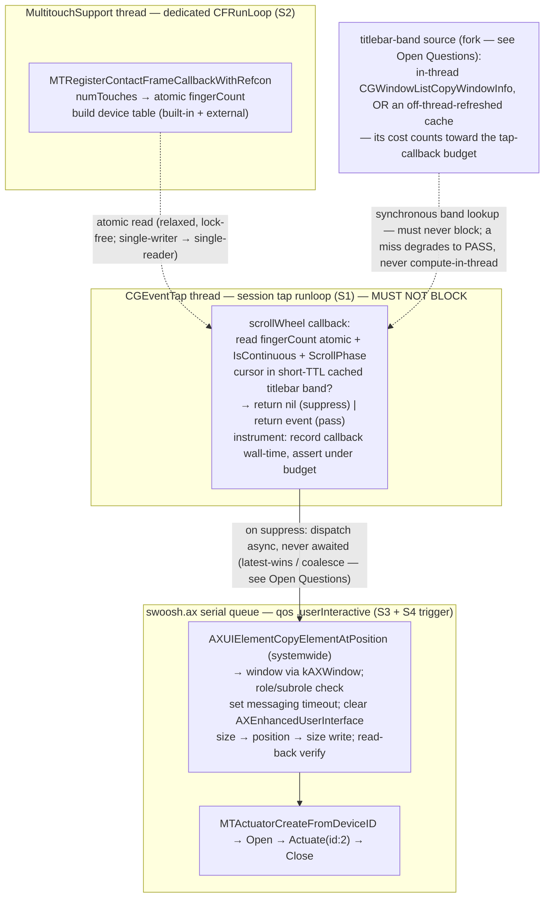

# M0 De-Risk Spike — S1–S4 on macOS 14 / 15 / 26

## Summary

Build a single **throwaway** Swift command-line spike that proves the four load-bearing mechanisms Swoosh depends on — capture/suppress (S1), finger-count (S2), off-thread AX locate+act (S3), and background haptic actuation (S4) — green on macOS 14, 15, and 26. This is the go/no-go gate for the whole project: nothing downstream (engine, recognizer, UI, packaging) is built until all four pass, and any criterion that can't pass routes to an explicit pivot (NSEvent Plan B, `MTActuator`, graceful-degrade, or abort). The spike is deleted once the gate resolves; it is deliberately **not** the product's SwiftPM skeleton.

---

## Problem Frame

Swoosh's whole technical thesis rests on composing public APIs (`CGEventTap`, `AXUIElement`) with private/undocumented ones (`MultitouchSupport.framework`, likely `MTActuator`, the `"AXFullScreen"` attribute) — none carrying a stable ABI. That fragility is precisely what killed the last free trackpad window manager (Penc, dormant since 2021), and two confirmed macOS hazards make the risk concrete: the `.mayBegin` scroll phase was silently removed in Monterey (FB9724671, which broke Swish) and a synchronous AX hit-test can stall scrolling ~500ms (FB11586064). The strategy is not to avoid the private path — the public path cannot do system-wide titlebar gestures — but to **prove it works up front and keep it covered forever** (see origin: `docs/brainstorms/2026-05-30-swoosh-product-requirements.md`, `DERISK.md §1`).

External research for this plan surfaced findings that **sharpen and partly contradict** the spec, and the spike must metabolize them rather than inherit the spec's assumptions verbatim:

- The public `NSHapticFeedbackManager` is silenced for non-frontmost processes by Apple design (confirmed by BetterTouchTool's identical background-daemon failure in production) — so S4 is built directly on private `MTActuator`, which all but confirms it as the **fourth private surface**.
- Multiple sources indicate `MultitouchSupport` / the active event tap requires **Input Monitoring** on macOS 14/15 — contradicting `SPEC.md §7`'s "needs no Input Monitoring as of macOS 14" assumption and the origin's R3 "no Input Monitoring prompt" pass condition. The spike must **measure** the true TCC requirement, not assume it.
- On Apple Silicon (arm64e), pointer authentication (PAC) makes `dlopen`/`dlsym` **mandatory** for these private symbols — direct linkage causes bus errors — and that brings concrete signing prerequisites (`disable-library-validation`, no sandbox).

---

## Key Technical Decisions

- KTD1. **One throwaway Swift CLI spike, not the product skeleton.** The spike lives entirely under `spike/m0/`, is compiled with `swiftc` directly (deliberately **no** SwiftPM `Package.swift`, no app bundle), and is deleted once the gate resolves. This honors the `CLAUDE.md` no-premature-stubs rule — the spike must not masquerade as the real four-layer project. Rationale: `DERISK.md §1` defines M0 as "no UI, no settings, no packaging"; a SwiftPM manifest or `Sources/` tree would be exactly the premature skeleton the project rejected.

- KTD2. **`dlopen`/`dlsym` for every `MultitouchSupport` / `MTActuator` symbol — mandatory, not stylistic.** arm64e PAC causes bus errors when private-framework symbols are called via direct extern linkage or `-framework` linking. Load `/System/Library/PrivateFrameworks/MultitouchSupport.framework/MultitouchSupport` with `dlopen(…, RTLD_LAZY)` and resolve each symbol with `dlsym`. Confirmed by every working wrapper (`mactic`, `MTMR`, `OpenMultitouchSupport`).

- KTD3. **S4 builds directly on private `MTActuator`; the public path is eliminated up front.** `NSHapticFeedbackManager` does not actuate from a non-frontmost process (Apple design; BTT production failure). The spike records the public path as "eliminated by design" and proves S4 on `MTActuator` (`MTActuatorCreateFromDeviceID` → `Open` → `Actuate(actuationID: 2)` → `Close`). This **likely** promotes `MTActuator` to a fourth private surface that must enter the capability manifest (origin keeps this conditional — "up to four"; the spike records it as an explicit go/no-go trade-off in U6, not a foregone conclusion). *A deliberate, recorded deviation from origin R5's "public first, then fallback" framing.*

- KTD4. **Suppress/pass is decided synchronously from the finger-count atomic; AX never touches the tap thread.** The S2 `MultitouchSupport` thread writes `numTouches` to an atomic; the S1 tap callback reads that atomic plus a short-TTL cached cursor/titlebar-band heuristic and returns `nil` (suppress) or the event (pass) immediately. The precise `AXUIElementCopyElementAtPosition` hit-test runs only off-thread on the `swoosh.ax` serial queue — the structural fix for FB11586064. The `.mayBegin` phase is never used (FB9724671); finger count is the discriminant. This is the `SPEC.md §6` threading contract, proven in miniature.

- KTD5. **Spike signing & TCC posture.** Ad-hoc sign the bare binary (`codesign -s -`) with an entitlements plist carrying `com.apple.security.cs.disable-library-validation = true` and **no** `com.apple.security.app-sandbox` (the private framework is inaccessible to sandboxed and library-validated processes). Run as a bare Mach-O binary (not an `LSBackgroundOnly` app) to dodge the confirmed Sequoia regression where `CGEventTapCreate` returns `NULL` for `NSApplicationActivationPolicyProhibited` processes. Grant **both** Accessibility (active tap + AX writes) and Input Monitoring (multitouch) manually before each run.

- KTD6. **The spike measures TCC reality; it does not assume "Accessibility only."** Because research contradicts `SPEC.md §7`, the S2/S1 probes explicitly record which permissions are actually demanded on each OS. A required Input Monitoring grant is **not** an automatic S2 failure — it is a measured outcome that feeds back to `STRATEGY.md §5` (least-privilege) and origin R3/R39. (Also a Risk and an Open Question below.)

- KTD7. **S3 act path mirrors Rectangle.** Use the **size → position → size** write sequence (macOS clamps window size to the current display before honoring a cross-display move), temporarily clear `AXEnhancedUserInterface` on the target app element before writing (it silently corrupts `kAXPosition` writes in Chrome/Electron/Firefox), set a tight `AXUIElementSetMessagingTimeout` (~150ms) to avoid hanging on unresponsive apps, and **read back** position after writing to detect silent no-ops.

- KTD8. **The finger-count hand-off is a single-writer/single-reader lock-free atomic with explicitly-relaxed ordering — no lock on the read path.** The multitouch callback thread is the sole writer; the tap callback is the sole reader; only the latest count matters and no dependent payload is published alongside it, so a relaxed atomic load/store is sufficient and is chosen specifically to keep the realtime read non-blocking — a lock (e.g. `os_unfair_lock`) would reintroduce the tap-thread blocking the whole design exists to avoid, so it is named-to-reject. The macOS-14 floor (R6) **rules out Swift's `Synchronization.Atomic`** (macOS 15+), and `swift-atomics` would require the SwiftPM manifest KTD1 forbids — so the concrete primitive is a tiny **C shim** exposing `atomic_load_explicit`/`atomic_store_explicit` with `memory_order_relaxed`, bridged into the `swiftc`-direct build; the spike confirms that shim compiles in U1 and logs the primitive it used across all three OS floors. Rationale: `SPEC.md §6.1`/`§7` say "atomic" without specifying ordering or mechanism, and shipping an unspecified primitive into M2+ as a load-bearing contract is exactly the kind of "works on the dev machine" hazard M0 exists to retire.

- KTD9. **The spike is written in Swift, not C — deliberately, to prove the bridging the product needs.** The primary references (`mactic`) are C, so a C spike would mirror them more directly; Swift is chosen anyway because the eventual product is Swift and the spike is the right place to prove the *Swift-bridging* risk of the private structs — the `MTTouch` layout across the C ABI boundary, refcon-closure bridging for the contact callback, and the `sizeof == 96` assertion from Swift. The C references are read and translated, not linked.

---

## High-Level Technical Design

The spike's correctness is a *threading* property: three concurrent contexts share one atomic, and the realtime tap thread must do zero blocking work. The diagram makes the "tap thread never blocks" contract — the thing the spike most needs to prove — legible at a glance.

Build/teardown sequence (directional, not a script): grant TCC → ad-hoc sign with entitlements → launch → start the `MultitouchSupport` thread → install the session tap → exercise gestures / run the matrix → write the decision log → on exit, **tear down in strict order — disable the tap → drain/cancel `swoosh.ax` → stop the `MultitouchSupport` device → join its runloop thread** — so no act item runs against a half-destroyed context.

---

## Requirements

Adapted from the origin's M0 group (see origin: `docs/brainstorms/2026-05-30-swoosh-product-requirements.md`), R-IDs preserved for traceability. Where research since the brainstorm warranted a change, the deviation is marked inline (R3, R5, R7).

**Spike gate & matrix**

- R1. The spike is a throwaway program (no UI, no settings, no packaging) proving the mechanisms on real hardware; nothing downstream is built until all four criteria pass.
- R6. S1–S4 run on macOS 14 (Sonoma), 15 (Sequoia), and 26; a criterion is "passed" only when green on all three.
- R9. Any change to `EventTap` or the gesture recognizer must re-pass this matrix (or its replayer equivalent) before merge — the spike establishes the baseline that hard rule re-checks against.

**Per-criterion proofs**

- R2. S1 — a session `CGEventTap` decides suppress/pass synchronously from fast geometry (no AX on the tap thread), swallows a two-finger titlebar pan, passes normal scroll on the same titlebar, with no jank and never blocking the tap thread.
- R3. S2 — `MultitouchSupport` via `dlopen`/`dlsym` + `MTRegisterContactFrameCallback` reports an accurate, low-latency contact count (0→2→0 within one frame). **Deviation from origin R3:** the "no Input Monitoring prompt" clause is reclassified from a pass condition to a *measured outcome* (KTD6) — the spike records the actual per-OS TCC requirement and, if Input Monitoring is confirmed required, that routes to a forced decision in U6 (see Open Questions).
- R4. S3 — `AXUIElementCopyElementAtPosition` (off-thread) resolves the window, classifies the titlebar band, and a test `kAXPosition`/`kAXSize` write lands across Finder / Safari / an Electron app, with the AX call off the tap thread.
- R5. S4 — a ready/done tap actuates from a background, non-frontmost context on an external Magic Trackpad; built on `MTActuator` (public path eliminated per KTD3), with graceful degradation where an external actuator won't fire (see Acceptance matrix).

**Hazards & pivots**

- R7. The spike confronts the known hazards rather than discovering them in production: never depend on `.mayBegin` (FB9724671); demonstrate zero tap-thread blocking against the AX stall (FB11586064); record the actual TCC permissions demanded on macOS 14/15/26.
- R8. Pivot triggers are defined and their outcomes recorded: S1 unprovable → abort (suppression impossible); S2 unreliable → NSEvent Plan B for finger-count; **S2 passing but requiring Input Monitoring → does *not* auto-resolve "go" — it forces a recorded strategy decision (accept the second permission and revise `STRATEGY.md §5`/origin R39, or invoke NSEvent Plan B to hold least-privilege)**; S4 unprovable on private path → ship without haptics (degrade); private-struct drift → hard fail + re-derive.

---

## Implementation Units

Units are ordered by dependency (build order), which differs from the S1–S4 criterion numbering: finger-count (S2) is foundational and is built before suppression (S1) because the tap reads its atomic.

### U1. Spike scaffold — build, signing, TCC, and the private-framework loader

- **Goal:** A buildable, runnable, ad-hoc-signed bare binary that can `dlopen` `MultitouchSupport`, resolve all needed symbols, assert struct-layout sanity, and emit a structured decision/measurement log — the foundation every probe builds on.
- **Requirements:** R1, R7 (signing/TCC groundwork)
- **Dependencies:** none
- **Files:**
  - `spike/m0/main.swift` (entry point; arg-dispatch which probe(s) to run; logging setup)
  - `spike/m0/PrivateSymbols.swift` (`dlopen` + `dlsym` of `MTDeviceCreateList`, `MTDeviceCreateDefault`, `MTDeviceGetDeviceID`, `MTRegisterContactFrameCallbackWithRefcon`, `MTDeviceStart`, `MTDeviceStop`, `MTDeviceIsBuiltIn`, and the `MTActuator*` family; the `MTTouch` layout + `sizeof == 96` runtime assertion)
  - `spike/m0/DecisionLog.swift` (append-only JSONL log of every measurement/decision, written to disk so the matrix run is auditable)
  - `spike/m0/m0.entitlements` (`com.apple.security.cs.disable-library-validation = true`; **no** app-sandbox key)
  - `spike/m0/build.sh` (throwaway: `swiftc` compile + `codesign -s -` with the entitlements; deleted with the spike)
  - `spike/m0/README.md` (throwaway: how to grant Accessibility + Input Monitoring, run a probe, and read the log)
- **Approach:** Pure `dlopen`/`dlsym` per KTD2 — no bridging to `.linkedFramework`. Resolve `MTDeviceGetDeviceID` via `dlsym` and prefer it for device-ID extraction; fall back to the empirical offset-64 `memcpy` only if the symbol is absent or returns zero (mark which path was used in the log). Assert `sizeof(MTTouch) == 96` at startup and **hard-fail with a clear error** on mismatch rather than reading garbage (origin R17's drift-detection principle, in miniature). Every probe also asserts-and-logs its own TCC trust state (`AXIsProcessTrusted`, `IOHIDCheckAccess`) at startup, so a grant silently zeroed by a re-sign reads as "not trusted" rather than as a mechanism failure (see the code-signing-churn risk).
- **Patterns to follow:** `mactic` (`https://github.com/MatMercer/mactic`) — single-file `dlopen` + struct-offset reference; the `hs._asm.undocumented.touchdevice` header (asmagill) for canonical symbol declarations. **Read for reference; verify each repo's license before copying any code.**
- **Test scenarios:**
  - Binary builds and runs as a bare Mach-O on Apple Silicon without a bus error (proves the `dlopen`/PAC path).
  - `dlopen` of the framework returns non-null; every required symbol resolves via `dlsym` (log absent symbols by name).
  - `sizeof(MTTouch) == 96` assertion passes on the test machine; deliberately corrupting the expected size makes the probe hard-fail loudly (proves the drift guard works).
  - Running with `disable-library-validation` absent fails to load the framework (confirms the entitlement is load-bearing) — documented, not a CI gate.
  - `Test expectation:` scaffold is non-feature-bearing infrastructure; the above are smoke checks, not behavioral coverage.
- **Verification:** A single command produces a log line per resolved symbol and a `MTTouch`-size confirmation; the binary exits 0 with no crash on all three OS targets.

### U2. S2 probe — `MultitouchSupport` finger-count via a dedicated runloop thread

- **Goal:** Prove an accurate, low-latency two-finger contact count is readable from `MultitouchSupport`, exposed as a lock-free atomic for the tap thread, and record which TCC permission the framework actually demands.
- **Requirements:** R3, R6, R7, R8 (Plan-B trigger on failure)
- **Dependencies:** U1
- **Files:**
  - `spike/m0/MultitouchClient.swift` (device enumeration; callback registration; `fingerCount` atomic; latency measurement)
- **Approach:** Enumerate `MTDeviceCreateList` (not just `MTDeviceCreateDefault` — the external Magic Trackpad is only in the list), filter via `MTDeviceIsBuiltIn`, register `MTRegisterContactFrameCallbackWithRefcon` (refCon variant for clean Swift-closure bridging) on each device, and `MTDeviceStart(device, 0)` from a **dedicated** POSIX thread running its own `CFRunLoop` (the callback fires on the thread that called `MTDeviceStart`; if that thread exits, frames stop). Write `numTouches` to an atomic the S1 tap reads. Register exactly once per device (registration is exclusive). On the TCC question (KTD6): run once with Input Monitoring granted and once revoked, and record whether frames still arrive — this is the actual measurement that resolves the `SPEC.md §7` contradiction. The hand-off to the tap thread uses the lock-free relaxed atomic pinned in KTD8; the spike records which concrete primitive it used, since the macOS-14 floor rules out `Synchronization.Atomic`.
- **Patterns to follow:** `mactic`; `OpenMultitouchSupport` (Kyome22) for the Swift wrapper shape (note its macOS 15 floor — read, don't depend); `rmhsilva` gist for the minimal bootstrap.
- **Test scenarios:**
  - Physically touching two fingers flips the atomic 0→2→0 within ~one frame; latency is logged.
  - An external Magic Trackpad's contacts are reported (proves list-enumeration, not just the built-in default).
  - Frames continue arriving with Input Monitoring **granted**; record behavior when **revoked** (the measured TCC outcome for KTD6).
  - Touch counts are read on a non-tap thread and never block (the atomic is write-by-MT-thread, read-by-tap-thread).
  - `Covers R3.` Accurate 0→2→0 transitions across Finder/desktop focus changes.
  - On simulated decode mismatch (struct drift), the probe hard-fails rather than reporting a garbage count (Plan-B trigger path, R8).
- **Verification:** Decision log shows accurate, low-latency two-finger transitions on built-in and external trackpads across macOS 14/15/26, plus an explicit "Input Monitoring required: yes/no" measurement per OS.

### U3. S1 probe — session `CGEventTap` capture & suppression with a never-block proof

- **Goal:** Prove the tap can swallow a two-finger titlebar pan while passing normal scroll on the same titlebar, decided synchronously, with instrumentation that *demonstrates* the callback never blocks.
- **Requirements:** R2, R6, R7, R8 (abort trigger on failure)
- **Dependencies:** U1, U2
- **Files:**
  - `spike/m0/EventTapProbe.swift` (tap install; callback; suppress/pass logic; phase logging; never-block instrumentation; disable/re-enable handling)
- **Approach:** `CGEventTapCreate(kCGSessionEventTap, kCGHeadInsertEventTap, kCGEventTapOptionDefault, CGEventMaskBit(kCGEventScrollWheel), …)` — narrow scroll-wheel-only mask (a broad mask silently disables the system three-finger look-up gesture). Assert the create returns non-nil; if nil, log Accessibility state and activation policy (the Sequoia `LSBackgroundOnly` → NULL regression). In the callback: read `kCGScrollWheelEventIsContinuous` (0 = mouse → pass immediately), then `kCGScrollWheelEventScrollPhase`, then the S2 finger-count atomic + the cached titlebar-band heuristic; return `nil` to suppress only when all hold, else return the event. Handle `kCGEventTapDisabledByTimeout`/`…ByUserInput` by calling `CGEventTapEnable(tap, true)` inside the callback. **Never-block proof (two-threshold, measured — not self-certified):** First *measure* the hard ceiling rather than assume the ~70ms folklore — a disabled-by-default dwell-sweep mode sleeps the callback for increasing dwells until `kCGEventTapDisabledByTimeout` actually fires, per OS, yielding a measured per-OS disable threshold. Then freeze the **operating budget at ≤5% of that measured ceiling and ≤~1ms absolute** (a 60Hz scroll frame is ~16.6ms; the callback must be invisible within a frame) *before* the measurement run, so the budget is not tuned to fit the instrumentation. Record callback latency as a full distribution (p50/p95/p99/p999/max), and a CPU-time-vs-wall-time delta so a wall-time spike is correctly attributed to *preemption* vs *blocking work*. The band-source lookup cost (KTD's BAND fork) and the `dispatch_async` enqueue are both inside the measured window. Separately, a disabled-by-default mode routes an AX call onto the tap thread to *reproduce* the FB11586064 stall — used as a positive control for the U4 differential, not as production behavior.
- **Patterns to follow:** Hammerspoon `libeventtap.m` (`https://github.com/Hammerspoon/hammerspoon/blob/master/extensions/eventtap/libeventtap.m`) — tap setup + re-enable; `mac-disable-scroll-accel` / `UnnaturalScrollWheels` for the `IsContinuous` + triple-zero-phase mouse/trackpad discriminator.
- **Test scenarios:**
  - `Covers R2.` A two-finger pan on a Finder/Safari titlebar is swallowed (the window does not scroll); a two-finger scroll in the document area passes through unaffected.
  - First scroll-phase observed at gesture start is `Began` (1), never `MayBegin` (128), on all three OSes (confirms FB9724671 handling).
  - A discrete mouse wheel (`IsContinuous == 0`) always passes through.
  - The dwell-sweep measures the actual `kCGEventTapDisabledByTimeout` threshold per OS — reported as a **distribution across N runs and idle/loaded/thermal states with a variance bound**, and confirmed to be the *timeout* disable reason (not `…ByUserInput`). If the threshold is not stable, the operating budget falls back to a conservative fixed absolute (≤~1ms), not a percentage of a moving target.
  - **Adversarial never-block matrix:** callback latency (p50/p95/p99/p999/max) stays under the frozen operating budget in *every* cell of {sustained scroll burst} × {idle, contended `swoosh.ax` queue, 100+ windows on screen, a slow/unresponsive target app, CPU pressure, a competing `MultitouchSupport`/`CGEventTap` client (actor A5)}, with zero timeout events — a green only in the idle cell is not a pass. (The A5 cell distinguishes **CGEventTap** contention — both clients hold session taps, expected to stay under budget — from **`MultitouchSupport` registration** contention, which is exclusive per device, where the expected, *recorded* outcome is "frames stop," not "under budget.")
  - Tap survives sleep/wake and a forced `tapDisabledByTimeout` (re-enable path fires).
  - If suppression cannot be made jank-free, the log records the abort trigger (R8).
- **Verification:** On all three OSes, titlebar pans are suppressed, normal scroll is untouched, no visible jank, and the never-block instrumentation shows the callback stays under the frozen operating budget (≤5% of the measured per-OS disable threshold and ≤~1ms) in every adversarial cell, with zero `kCGEventTapDisabledByTimeout` events.

### U4. S3 probe — off-thread AX locate + window move/resize

- **Goal:** Prove that, off the tap thread, the spike can resolve the window under the cursor and reliably move/resize it via AX across real apps — without re-introducing the FB11586064 stall.
- **Requirements:** R4, R6, R7
- **Dependencies:** U1, U3
- **Files:**
  - `spike/m0/AXActProbe.swift` (`swoosh.ax` serial queue; locate; role/subrole check; size-position-size write; AXEnhancedUserInterface handling; read-back)
- **Approach:** A single `DispatchQueue(label: "swoosh.ax", qos: .userInteractive)`. The tap (U3) snapshots `CGEventGetLocation` and dispatches async (never awaited). On the queue: `AXUIElementCopyElementAtPosition(AXUIElementCreateSystemWide(), x, y, &el)`, walk to the window via `kAXWindowAttribute`, confirm `kAXRoleAttribute == kAXWindowRole` and `kAXSubroleAttribute == kAXStandardWindowSubrole`; `AXUIElementSetMessagingTimeout(window, 0.15)`; read + clear `AXEnhancedUserInterface` on the parent app element, perform the **size → position → size** write (KTD7), restore the attribute, then read back position to detect a silent no-op. Coordinates are AX global top-left origin; flip only when an intermediate uses `NSScreen` (bottom-left) space, using the primary screen's height. Under a sustained pan the tap can enqueue faster than AX drains; the spike's job here is narrow — confirm `swoosh.ax` depth **stays bounded** under a multi-second burst (unbounded growth would be a structural blocker), dispatching one act per suppressed event. Designing the latest-wins/coalescing *policy* is M2 recognizer work (it needs gesture phase boundaries that don't exist yet) and is **not** implemented in the throwaway spike. Every AX call — locate, each of the three writes, read-back — is **timed** so the per-app round-trip is recorded informationally (is it pathological?), with the move-detector's own latency floor (`kAXMovedNotification`/`CGWindowList` poll) noted so the number reads as a conservative upper bound. The off-thread fix removes the FB11586064 stall from the *scroll* path but does not make the ~500ms vanish — it becomes snap latency; the spike measures it, but the binding latency SLA is **established in M2**, where the full gesture→snap pipeline exists.
- **Patterns to follow:** Rectangle `AccessibilityElement.swift` (`https://github.com/rxhanson/Rectangle/blob/main/Rectangle/AccessibilityElement.swift`) — the write sequence + AXEnhancedUserInterface workaround; `AXSwift` `UIElement.swift` for `AXValue` bridging; yabai `window_manager.c` for the low-level pattern.
- **Test scenarios:**
  - `Covers R4.` A test write visibly moves and resizes a standard `NSWindow` app (Finder), a SwiftUI app, and an Electron/Chrome window.
  - FB11586064 differential: the on-thread positive control **must first reproduce** a ≥100ms scroll stall against ≥2 named targets (the FB-report repro + a SwiftUI app with a focused `ScrollView`), stall magnitude logged per app per OS; only then does showing the off-thread `swoosh.ax` path *not* stall count as a pass. If the control doesn't reproduce on an OS cell, that cell is recorded **inconclusive**, never pass.
  - Under a sustained multi-second pan, `swoosh.ax` depth stays **bounded** below a reasonable ceiling (one act per suppressed event); unbounded growth is a structural blocker. *(Coalescing-policy design deferred to M2.)*
  - AX round-trip (locate + each write + read-back) is timed per call across Finder / SwiftUI / Chrome-Electron and recorded in `RESULTS.md` as an informational data point with the move-detector floor noted — confirming it is not pathological, **not** establishing a binding SLA (that is M2's job).
  - A Chrome/Electron window with `AXEnhancedUserInterface` on lands at the correct final position only when the attribute is cleared first (proves the workaround is load-bearing).
  - A cross-display move lands correctly because of size-position-size; skipping the leading size write produces wrong geometry (documented).
  - A window that ignores `kAXPosition` (older Java / some Electron) is detected via read-back and logged as a no-op, no crash (origin R33).
  - The matrix exercises macOS 15/26 with native tiling both **on** (placement may be overridden) and **off** (clean baseline).
- **Verification:** AX writes land correctly across the app matrix with native tiling off; read-back detects silent failures; no scroll stall when the hit-test is on `swoosh.ax`.

### U5. S4 probe — `MTActuator` background haptic actuation

- **Goal:** Prove a haptic tap fires from a background, non-frontmost process on a real external Magic Trackpad — and characterize the external-vs-built-in reliability gap honestly.
- **Requirements:** R5, R6, R8 (degrade trigger)
- **Dependencies:** U1, U2 (reuses the device table)
- **Files:**
  - `spike/m0/HapticProbe.swift` (actuator open/actuate/close; per-device attempts; with/without-contact tests)
- **Approach:** Public path is **not** attempted (KTD3); the log records `NSHapticFeedbackManager: eliminated (background-silenced by design)`. For each device in the U2 table, obtain its device ID (prefer `MTDeviceGetDeviceID`, fallback offset-64), `MTActuatorCreateFromDeviceID` → `MTActuatorOpen` → `MTActuatorActuate(ref, 2, 0, 0.0, 0.0)` (actuationID 2 = strong click; IDs 1–6 are the cross-confirmed safe set) → `MTActuatorClose`, checking `IOReturn` at each step. Test from a genuinely background (non-frontmost, no `NSApplication` activation) context. Because the external actuator may be gated on touch presence, run each actuation **twice** — once with a finger resting on the pad, once with no contact — and record both outcomes. Caveat the spike records honestly: a bare Mach-O with no `NSApplication` (KTD5) has no activation status at all, so a green here proves *actuation works on this hardware* but does not fully reproduce the product's eventual background-*agent* posture (a registered `LSUIElement` whose frontmost-arbitration is exactly what silences `NSHapticFeedbackManager`); U5 logs this scope limit rather than over-claiming R5, and the agent-posture case is re-validated in M3.
- **Patterns to follow:** `mactic` (the actuate chain + device-ID offset); HapticKey (`https://github.com/niw/HapticKey`) — proves background actuation from a menu-bar agent; MTMR `HapticFeedback.swift` for the typed wrapper + `IOReturn` checks; the niw gist for signature-level truth.
- **Test scenarios:**
  - `Covers R5.` A tap is felt on the **built-in** trackpad from the background, no UI surfaced.
  - A tap is felt on an **external** Magic Trackpad 2 from the background (the criterion's hardest case); record pass/partial/fail.
  - With-contact vs no-contact actuation outcomes are both recorded (surfaces the touch-presence gating).
  - Each `MTActuator*` call's `IOReturn` is logged; a non-success short-circuits with a clear message.
  - On macOS 15/26 specifically, record any intensity/quality degradation (Sequoia changed haptic internals).
  - `MTActuator` Open→Actuate→Close latency is logged as a diagnostic (useful for the degrade decision). *(Actuation-to-visual-move skew is deferred to M3 — there is no snap animation in the spike to skew against.)*
- **Verification:** Built-in actuation fires reliably from the background on all three OSes; external-trackpad behavior is characterized (pass / partial / fail with the contact-gating note), feeding the Acceptance matrix and the R8 degrade decision.

### U6. Cross-OS matrix runner + go/no-go report

- **Goal:** Run all four probes on macOS 14/15/26, capture the decision log, and produce the S1–S4 pass/partial/fail matrix plus the explicit pivot-trigger evaluation that resolves the gate.
- **Requirements:** R1, R6, R7, R8, R9
- **Dependencies:** U2, U3, U4, U5
- **Files:**
  - `spike/m0/run-matrix.sh` (throwaway: orchestrates probes, captures environment + OS version, collects the JSONL logs)
  - `spike/m0/RESULTS.md` (the human-readable go/no-go report + the filled matrix; the durable artifact that survives the spike's deletion)
- **Approach:** Drive each probe per OS, with S3 run under native-tiling on/off. Aggregate the `DecisionLog` JSONL into the matrix. Evaluate the pivot triggers (R8) against the measured results and **record the decision**: proceed to M1, or take a named pivot. Two measured outcomes route to *forced* decisions rather than silent absorption: (1) if **Input Monitoring is required** on any OS, the gate records the chosen strategy resolution (accept + revise `STRATEGY.md §5`/origin R39, or NSEvent Plan B to hold least-privilege) before M1 scope is set; (2) if **`MTActuator` is confirmed required**, the gate records the explicit trade-off — ship haptics at a four-private-surface count vs. degrade haptics to hold the three-surface auditability story — keeping origin's "up to four" conditional framing. The matching closure edits (`STRATEGY.md §5` private-surface ledger / origin R46; the R39 onboarding text) land in the **same commit** that archives `RESULTS.md`. `RESULTS.md` also records the **numeric performance baseline** — the measured per-OS disable threshold, the adversarial-cell callback p999/max, the max `swoosh.ax` queue depth under burst, and the measurement machine class — the baseline the `§6` hard-rule re-check (R9) diffs against (end-to-end snap latency is recorded too, but informational, not an R9 baseline). **Hardware/OS prerequisites are a real blocker, not just a risk:** three bootable macOS installs (14/15/26 — macOS 26 is months old, and a VM's `CGEventTap`/`MultitouchSupport` fidelity is itself unverified) plus an external Magic Trackpad reachable on each; if only a subset is available the gate is *interim* and names the unproven OSes. `RESULTS.md` is the only file that outlives the spike — it is the input to the M1 go decision.
- **Patterns to follow:** none (orchestration + reporting).
- **Test scenarios:** `Test expectation: none` — this unit produces the report; its "tests" are the probe results it aggregates. (Sanity check only: the runner exits non-zero if any probe crashes, so a missing row is never silently a pass.)
- **Verification:** `RESULTS.md` contains a complete S1–S4 × {14,15,26} matrix with pass/partial/fail per cell, the TCC measurement, the external-haptic characterization, the numeric performance baseline (measured disable threshold, callback tail latencies under adversarial load, informational end-to-end snap latency, bounded queue depth, machine class), and an explicit go / pivot / abort decision with rationale. If Input Monitoring is required or `MTActuator` is confirmed, the matching `STRATEGY.md §5` / origin R39 / R46 closure edits are committed alongside `RESULTS.md` before M1 scope is defined.

---

## Acceptance / Pass Matrix

The gate resolves on these per-criterion conditions, evaluated on each of macOS 14 / 15 / 26.

| Criterion | Pass | Partial | Fail → pivot |
|---|---|---|---|
| S1 capture/suppress | Titlebar pan swallowed, normal scroll untouched, no jank, callback never near the disable threshold | Works but with measurable jank or rare missed suppression | Cannot suppress without breaking normal scroll → **abort** (suppression impossible) |
| S2 finger-count | Accurate 0→2→0 within ~one frame on built-in + external; TCC requirement measured | Works built-in only, or needs Input Monitoring (measured, feeds strategy) | Count unreliable / struct drift → **NSEvent Plan B** for finger-count |
| S3 AX locate+act | Move/resize lands across Finder/Safari/Electron with tiling off; no stall when off-thread | Works with per-app caveats (AXEnhancedUI, refusing apps logged) | Off-thread design still stalls scroll → re-architect or **abort** |
| S4 haptics | `MTActuator` fires from background on built-in **and** external trackpad | Fires built-in; external unreliable/contact-gated → **degrade gracefully** | No background actuation on the private path → **ship without haptics** |

A criterion is green for the gate only when **Pass** on all three OSes; any **Partial** is recorded with its degrade decision; any **Fail** triggers the named pivot before M1 begins.

**Pass conditions are numeric, not vibes.** Reported alongside the matrix, per OS: the *measured* `kCGEventTapDisabledByTimeout` threshold (from the dwell-sweep, not the ~70ms folklore), the callback p999/max under the *worst* adversarial cell, and the max `swoosh.ax` queue depth under burst (bounded: yes/no). End-to-end gesture→window-moved latency is recorded as an **informational** data point (is the AX act path pathological?), **not** a gate condition — the binding ≤Xms p95 SLA is set in M2 where the full pipeline exists. The measurement machine class is recorded and the tightest never-block budget is verified on the **lowest-spec supported target** available — a never-block claim proven only on a fast machine does not generalize to the support floor. "Never near the disable threshold" is unfalsifiable; these numbers are what make S1 defensible and what R9 re-checks against.

---

## Risks & Dependencies

- **Private-API ABI drift (high).** `MTTouch` (96 bytes) and the offset-64 device-ID hack are empirically reverse-engineered and not ABI-stable; the spike guards with a `sizeof` assertion and hard-fails on mismatch. Re-validate on every macOS beta (origin R9; `DERISK.md §6`).
- **TCC contradiction (high, decision-shaping).** Research says Input Monitoring is required where `SPEC.md §7` assumed it is not. If confirmed, the "Accessibility-only" least-privilege posture (`STRATEGY.md §5`) and origin R3/R39 need revisiting. The spike measures it; the resolution is an Open Question, not a spike-time blocker.
- **External-trackpad haptics (medium).** Open, undiagnosed reports of `MTActuator` firing on built-in but not external Magic Trackpad, possibly gated on active finger contact and degraded since Sequoia. S4 is scoped to allow graceful degradation rather than a hard external requirement.
- **Sequoia/Tahoe regressions (medium).** `CGEventTapCreate` returns NULL for `LSBackgroundOnly` processes on Sequoia (dodged via bare binary); native tiling can override AX writes on 15/26 (matrix covers tiling on/off); macOS 26 is only months old, so every surface is re-measured there rather than assumed.
- **Code-signing identity churn in the dev loop (medium — re-rated).** The spike is ad-hoc signed (`codesign -s -`) and recompiled repeatedly across U1–U5; an ad-hoc identity is not stable, so a TCC grant made for build *N* can silently not apply to build *N+1* (tap installs, `tapIsEnabled` true, no events) — which during a *measurement* spike can masquerade as a false S1/S2 fail or a corrupted TCC reading that poisons the gate. Mitigation (U1): use a stable self-signed identity (not bare ad-hoc) so grants persist, or document a mandatory re-add-after-`codesign` step, **and** have every probe assert-and-log its own TCC trust state (`AXIsProcessTrusted`, `IOHIDCheckAccess`) at startup so a stale grant reads as "not trusted," never as a mechanism failure.
- **Prior-art licensing (process).** `mactic`, Hammerspoon, Rectangle, AXSwift, MTMR, HapticKey are reference reading; verify each license before copying any code into the (later) MIT product.
- **Hardware dependency.** S4 in particular needs a real external Magic Trackpad on each OS target; S1–S3 need real trackpad hardware (not just a simulator) on macOS 14, 15, and 26.
- **Unbounded act-queue growth (medium).** Fire-and-forget `dispatch_async` with no backpressure means a fast pan (or a misfiring suppression heuristic) can enqueue AX work faster than the 150ms-bounded queue drains — climbing snap latency and growing memory in a long-running daemon. Mitigation: the spike confirms a measured max-queue-depth bound (U4/U6); the latest-wins/coalesce *policy* production needs is M2 recognizer work.
- **Stale-geometry suppression on the realtime path (medium).** The synchronous titlebar-band check trades freshness for non-blocking; too-stale geometry → suppress-on-stale, which swallows a normal scroll over the wrong region and **cannot be un-swallowed**. A cache miss must degrade to "pass the event," never to "compute synchronously." The spike reproduces a window-moved-since-cache case and records which way it fails (see Open Questions).
- **Machine-class / thermal variance (low–medium).** AX IPC and scheduling differ between low- and high-core machines and under throttling; the realtime budget is tightest on the lowest-spec target, so the matrix records machine class and verifies the worst case on the support floor, not only a fast machine.

---

## Scope Boundaries

**In scope:** the throwaway spike proving S1–S4 on macOS 14/15/26, the cross-OS matrix, and the go/no-go + pivot report.

**Deferred to Follow-Up Work** (everything downstream of the gate — origin M1–M6, planned only after M0 is green):

- The fraction-native snap engine, the fixture capture/replay harness, the real recognizer/suppression hardening, divider-drag, keyboard/restore, settings/onboarding, distribution — all of M1–M6.
- The real SwiftPM project skeleton (`Package.swift`, `Sources/`, the four-layer architecture). The spike is **not** that skeleton (KTD1).

**Outside this effort's identity:**

- Any UI, settings, packaging, signing-for-distribution, or notarization (`DERISK.md §1`: M0 is "no UI, no settings, no packaging").
- Productionizing the spike code. It is a measurement instrument, deleted once the gate resolves; only `RESULTS.md` survives.
- Carrying the spike's signing posture forward. `m0.entitlements` (`disable-library-validation`, no sandbox) is the broadest posture in the project and is a **named deletion target** — the product's entitlements are derived fresh from the minimal required set, never cargo-culted from the spike. Before any product build, the spike's Accessibility **and** Input Monitoring grants are revoked (or the spike runs from a distinct path, e.g. `/tmp/swoosh-spike`, that can't collide with the product's TCC slot) so the product's first-launch onboarding (origin F5/R37/R39) still fires instead of silently inheriting the spike's grants.

---

## Open Questions

**Resolve before planning M1 (answered by the spike itself):**

- Does `MultitouchSupport` / the active tap require Input Monitoring on macOS 14/15/26? (KTD6 / S2 measurement.) The answer determines whether `STRATEGY.md §5` least-privilege and origin R3/R39 hold or must be revised — surface the measured result back to the brainstorm/strategy.
- Is `MTActuator` confirmed as a required fourth private surface? (S4 outcome → origin R29/R46 + capability manifest.)
- Does S4 work on an external Magic Trackpad, or only built-in? (Sets whether external haptics is a feature or a documented limitation.)
- Is the AX act-path latency *pathological* on real hardware? The spike records it informationally; an alarmingly slow result on the support floor is itself a finding for `RESULTS.md`. The binding "feels like Swish" latency SLA is **not** set in M0 — it is established in M2 where the full gesture→snap pipeline exists; neither origin nor `SPEC.md` states one yet.

**Deferred to implementation (execution-time discovery):**

- Exact `swiftc` flags and the minimal entitlements set that satisfies `dlopen` on each OS (settle when the binary is first built and signed).
- **Titlebar-band source & staleness (fork to resolve in the spike):** is the band read from a direct in-thread `CGWindowListCopyWindowInfo` call or an off-thread-refreshed cache? If cached — who writes it, on what cadence, and how is it invalidated (window move/close/Space-switch/display-reconfig, not just TTL expiry)? Reproduce a window-moved-since-cache case and record the failure direction (suppress-on-stale vs miss-on-stale).
- **Act-phase supersession under sustained pan (fork):** is one act dispatched per suppressed event or per gesture, and does `swoosh.ax` need latest-wins coalescing / generation-token cancellation / phase-boundary debounce? Resolved by watching the queue under a real pan (U4).
- The callback wall-time budget is **not** tuned to fit the instrumentation (that would self-certify the gate). U3 derives it: measure the per-OS `kCGEventTapDisabledByTimeout` ceiling via a dwell-sweep, then freeze the operating budget at ≤5% of it (and ≤~1ms absolute) *before* the adversarial run.
- Whether `MTDeviceGetDeviceID` resolves and returns non-zero, or the offset-64 fallback is needed, per OS (measured in U1/U2).

---

## Sources / Research

Prior-art reference implementations (read first; verify license before copying):

- `mactic` — `https://github.com/MatMercer/mactic` — single-file `dlopen` + `MTTouch` offsets + `MTActuator` chain (S2 + S4).
- Hammerspoon `libeventtap.m` — `https://github.com/Hammerspoon/hammerspoon/blob/master/extensions/eventtap/libeventtap.m` — session tap setup + re-enable (S1).
- `hs._asm.undocumented.touchdevice` header — `https://github.com/asmagill/hs._asm.undocumented.touchdevice/blob/master/MultitouchSupport.h` — canonical symbol declarations.
- Rectangle `AccessibilityElement.swift` — `https://github.com/rxhanson/Rectangle/blob/main/Rectangle/AccessibilityElement.swift` — size-position-size + AXEnhancedUserInterface workaround (S3).
- `AXSwift` `UIElement.swift` — `https://github.com/tmandry/AXSwift/blob/main/Sources/UIElement.swift` — `AXValue` bridging (S3).
- HapticKey — `https://github.com/niw/HapticKey` and the niw gist `https://gist.github.com/niw/b120b460e854ec10cefeeb60784f5dbb` — background `MTActuator` actuation + signatures (S4).
- MTMR `HapticFeedback.swift` — `https://github.com/Toxblh/MTMR/blob/master/MTMR/HapticFeedback.swift` — typed actuator wrapper + actuationID semantics (S4).

Hazard primary sources:

- FB9724671 (`.mayBegin` removed in Monterey) — `https://github.com/feedback-assistant/reports/issues/235`.
- FB11586064 (`AXUIElementCopyElementAtPosition` ~500ms scroll stall) — `https://github.com/feedback-assistant/reports/issues/368`.
- Sequoia `LSBackgroundOnly` → `CGEventTapCreate` NULL — `https://developer.apple.com/forums/thread/758554`.

Origin: `docs/brainstorms/2026-05-30-swoosh-product-requirements.md` (M0 requirements R1–R9); `DERISK.md §1` (spike criteria), `SPEC.md §6–7` (threading + finger-count contract), `STRATEGY.md §5` (least-privilege posture under measurement).
